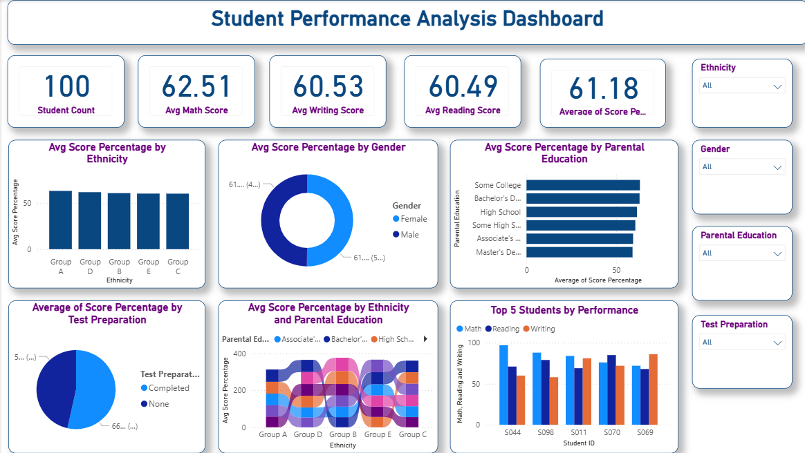

# Student Performance Analysis Dashboard

## Project Overview

This Power BI dashboard analyzes student academic performance using data on Math, Reading, and Writing scores. The dashboard provides insights into how performance varies across different demographic and educational factors.

## Objectives

* Analyze overall student performance.
* Compare average scores across different ethnic groups.
* Evaluate performance differences between male and female students.
* Assess the impact of parental education levels on student achievement.
* Examine the effect of test preparation courses on performance.
* Identify top-performing students.

## Dataset Information

The dataset contains 100 student records with the following attributes:

* Student ID
* Gender
* Ethnicity
* Parental Education
* Test Preparation
* Math Score
* Reading Score
* Writing Score

## Key Performance Indicators (KPIs)

The dashboard includes:

* Total Student Count
* Average Math Score
* Average Reading Score
* Average Writing Score
* Average Score Percentage

## Visualizations

* Average Score Percentage by Ethnicity
* Average Score Percentage by Gender
* Average Score Percentage by Parental Education
* Average Score Percentage by Test Preparation
* Ethnicity and Parental Education Analysis
* Top 5 Students by Performance

## Calculated Measure

Score Percentage was calculated using:

Score Percentage =
DIVIDE(
[Math Score] + [Reading Score] + [Writing Score],
300,
0
) * 100

## Tools Used

* Power BI Desktop
* Microsoft Excel

## Files Included

* myfirstdashboard.pbix
* student_performance_100.xlsx

## Author

Bahman Sariyev
Information Technologies Student
ADA University
